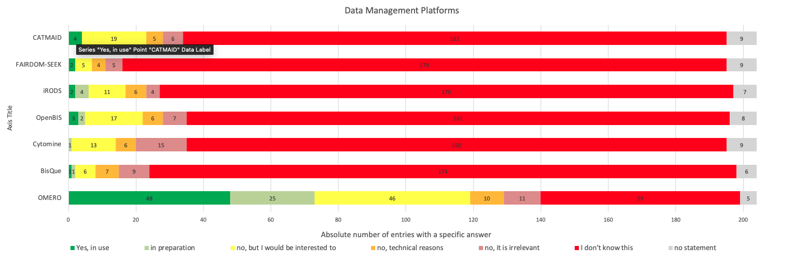

## Imaging Working Group Minutes

Thursday, 2021/09/16

10:00 am ET

## Attendees:

Terrell Russell, Alan King, Kory Draughn, Daniel Moore, David Fellinger, Andreas Müller (Osnabrück), Rolf Harkes (NKI - Netherlands Cancer Institute), Marjolijn Mertz (NKI - Netherlands Cancer Institute), Karen Bernhardt (U.Osnabrück), Josh Moore (Dundee / OMERO), Ken Langley (UNC SOM-IT), Hiroya Itoga (RIKEN), Shuichi Onami (RIKEN), Michelle Itano (UNC Microscopy), Paul van Schayck (Maastricht University), Caterina Strambio-De-Castillia (UMass Medical School), Mike Conway (NIEHS), Deep Patel (NIEHS)

## Minutes

 - Josh - BioImage proposal in flight
   - BIDS, Brain Image Data Specification
     - https://bids.neuroimaging.io/
   - ARC - data structure built atop of ISAtab
     - https://github.com/nfdi4plants/ARC-specfication/blob/main/ARC%20specification.md
   - Still on board with OMERO to have an endpoint to emit metadata generically
     - For any consumer to use (30ish participants/consumers)
       - German group interested in raising funds is circulating a user-survey to try to determine what is the need/awareness of Data Management among end-users
       - 
     - Most likely as RDF
     - Good chance of getting funded… targeting a year/so out

 - Paul - regarding NFSRODS… or directly atop S3?
   - S3 latency may be too high/long
   - So potentially NGFF, upload to S3, then register in OMERO pointer to S3 object

 - NGFF update...
   - Next Generation File Format
     - Next step from OME-TIFF file format
     - Hierarchical n-dimensional (dense) arrays image format
     - Object store compatible file format
   - https://ngff.openmicroscopy.org/latest/
   - https://www.biorxiv.org/content/10.1101/2021.03.31.437929v4.full
   - Working group
     - Quarterly call, next Dec 2021

 - Second iteration of our 'front-page' diagram could have
   - OMERO emits 'good' format of metadata on events -> push to Kafka/iRODS
   - Or a 'SAVE AS' in OMERO so new file would is user-initiated, rather than 'auto'/'all the time' pushing to iRODS (cf. Rendering changes)
   - However, 'Figure' and 'Analysis' (scripts) should probably be event-driven/automatic

 - Use Cases... configurability...
   - Add/update/remove a tag/AVU in iRODS (line 1)
   - Add/update/remove annotations in OMERO (line 2)
   - Import/Delete/Archive/Backups (line 3)
     - TGR - iRODS already has multiple physical replicas of data (if configured)
       - Replication is not backup
   - Change permissions in iRODS, visibility in OMERO should change? (line 1)
     - Vice versa? Josh: likely needs to be a “chgrp” (line 2)
   - Want to make sure we do not trigger infinite loops of updates
     - Can iRODS 'ignore' events initiated by iRODS activity in the OMERO API
     - OR OMERO could know NOT to emit.. But this seems wrong.
       - Because there could be other consumers watching that log too!

 - EventLog as it is today - we can investigate the current format/structure
   - https://docs.openmicroscopy.org/omero/5.6.3/developers/Server/Events.html?highlight=eventlog
   - one primary consumer: search
     - https://docs.openmicroscopy.org/omero/5.6.3/sysadmins/search.html?highlight=eventlog

 - Next Meeting
   - plan is monthly for now, will send invitation
   - Oct 21, 2021, 10am

