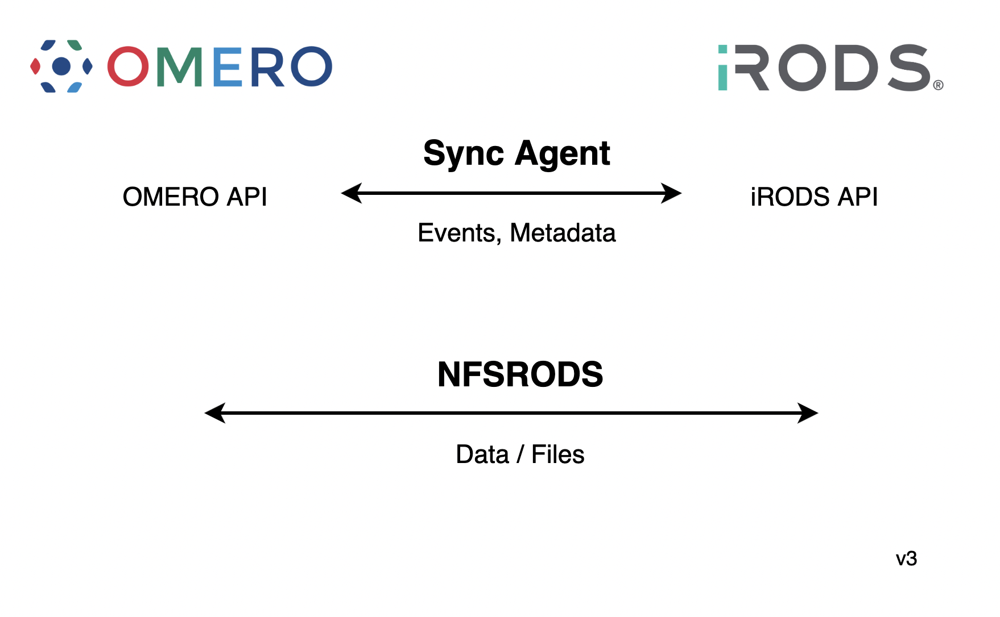

# iRODS Imaging Working Group

## Mission

To provide a standardized suite of imaging policies and practices for integration with existing tools and pipelines.

Initial effort will be an OMERO integration.

## Minutes

 - [20250320](20250320-minutes.md)
 - [20250221](20250221-minutes.md)
 - [20250116](20250116-minutes.md)
 - [20241017](20241017-minutes.md)
 - [20240919](20240919-minutes.md)
 - [20240815](20240815-minutes.md)
 - [20240717](20240717-minutes.md)
 - [20240620](20240620-minutes.md)
 - [20240418](20240418-minutes.md)
 - [20240321](20240321-minutes.md)
 - [20240215](20240215-minutes.md)
 - [20240118](20240118-minutes.md)
 - [20231019](20231019-minutes.md)
 - [20230922](20230922-minutes.md)
 - [20230817](20230817-minutes.md)
 - [20230720](20230720-minutes.md)
 - [20230518](20230518-minutes.md)
 - [20230420](20230420-minutes.md)
 - [20230316](20230316-minutes.md)
 - [20230216](20230216-minutes.md)
 - [20230119](20230119-minutes.md)
 - [20221215](20221215-minutes.md)
 - [20221020](20221020-minutes.md)
 - [20220915](20220915-minutes.md)
 - [20220818](20220818-minutes.md)
 - [20220721](20220721-minutes.md)
 - [20220616](20220616-minutes.md)
 - [20220519](20220519-minutes.md)
 - [20220421](20220421-minutes.md)
 - [20220317](20220317-minutes.md)
 - [20220217](20220217-minutes.md)
 - [20220120](20220120-minutes.md)
 - [20211021](20211021-minutes.md)
 - [20210916](20210916-minutes.md)
 - [20210715](20210715-minutes.md)

## Current Design

