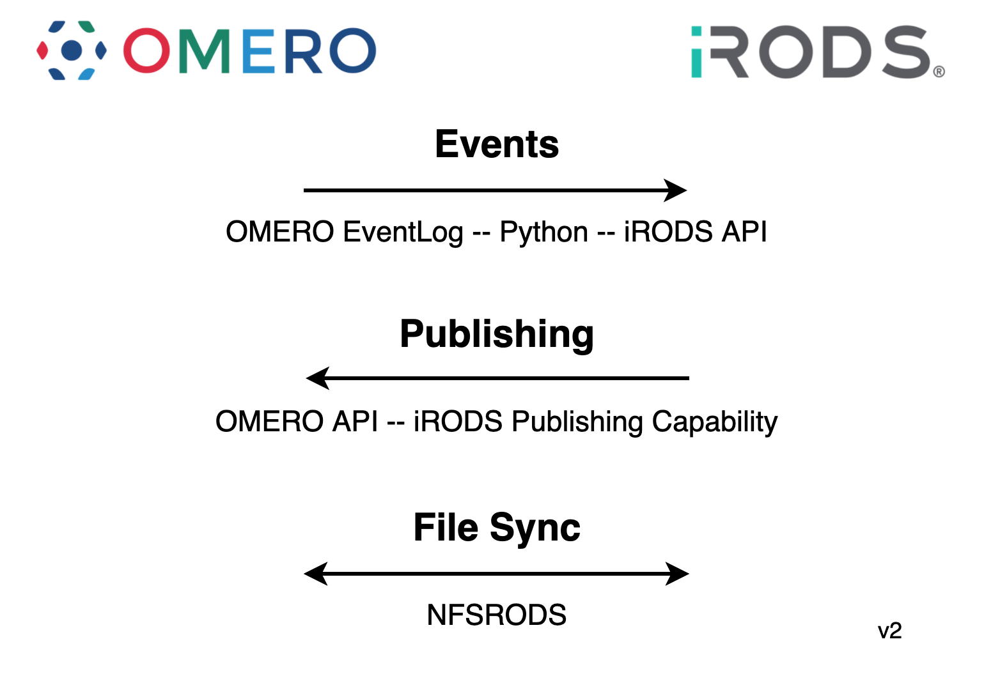

# iRODS Imaging Working Group

## Mission

To provide a standardized suite of imaging policies and practices for integration with existing tools and pipelines.

Initial effort will be an OMERO integration.

## Minutes

 - [20211021](20211021-minutes.md)
 - [20210916](20210916-minutes.md)
 - [20210715](20210715-minutes.md)

## Current Design

